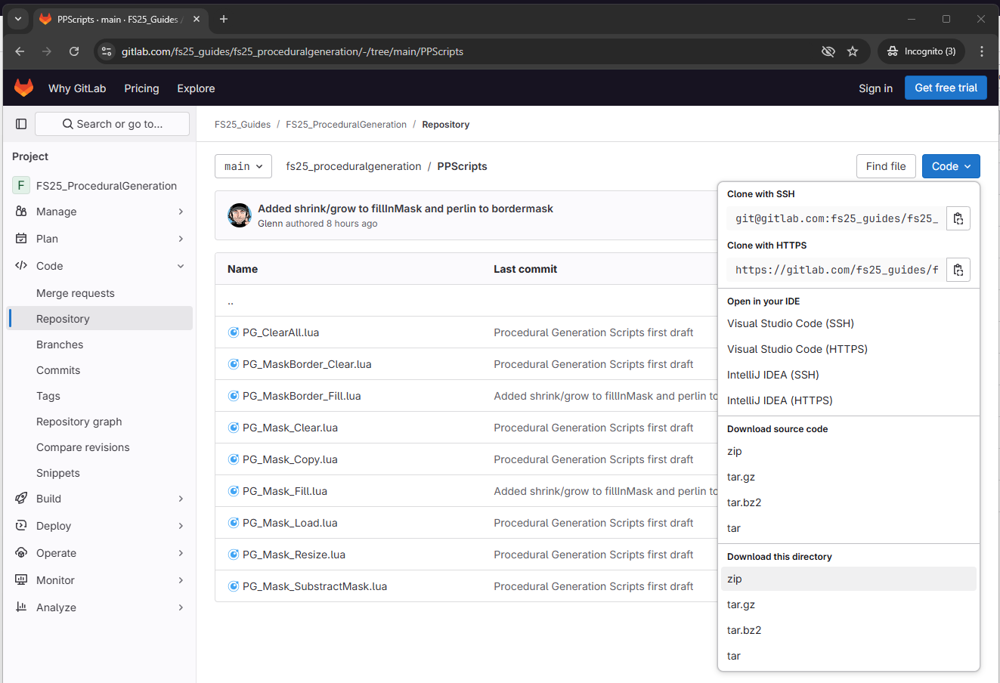
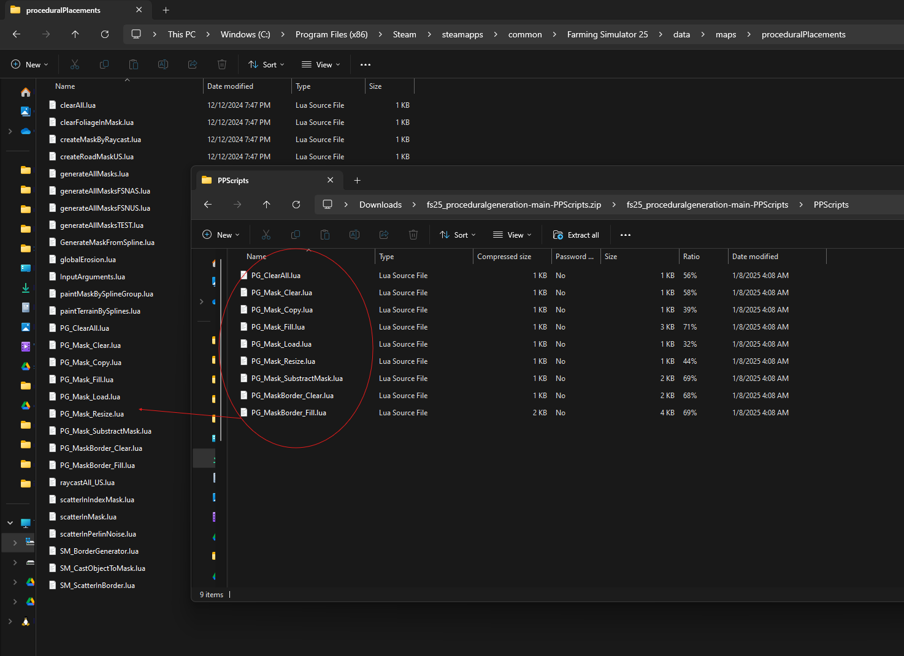
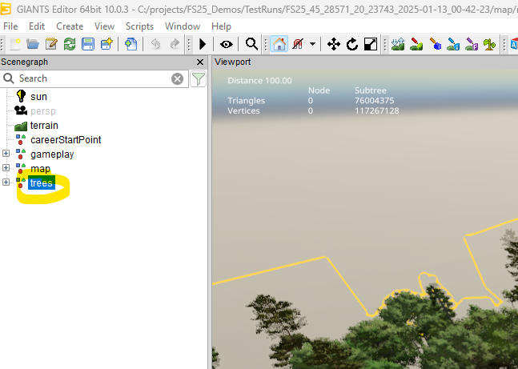
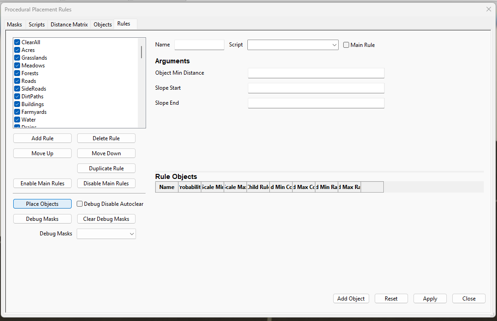
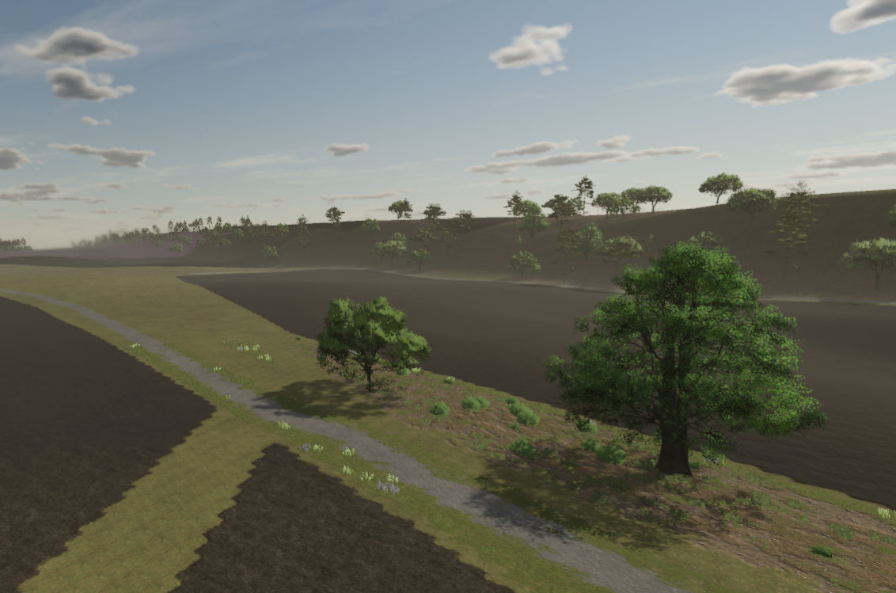
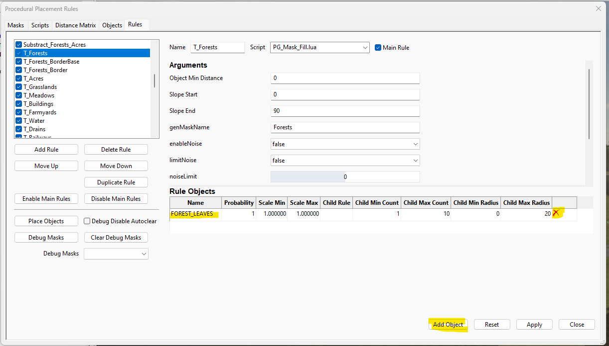
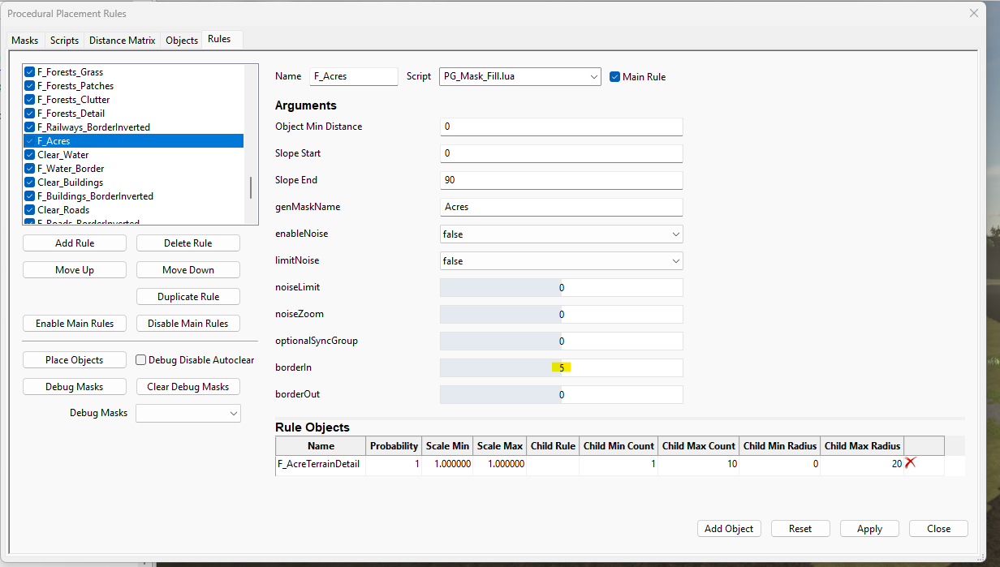
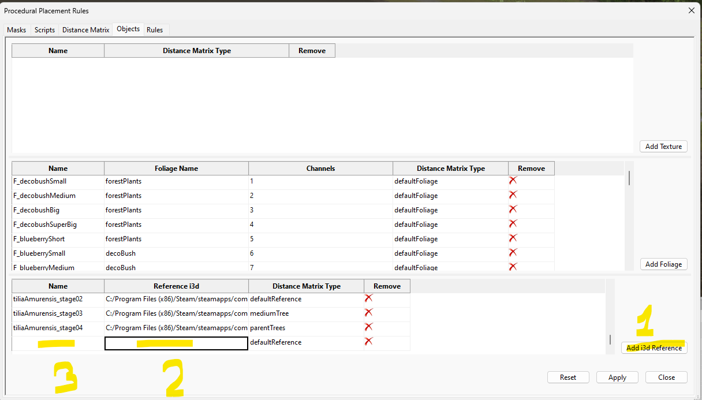
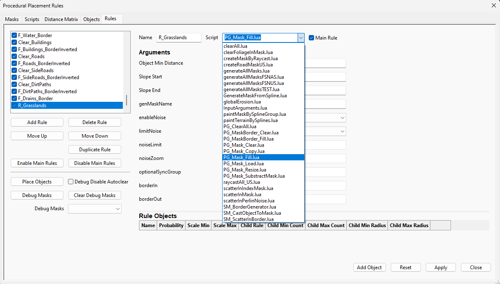
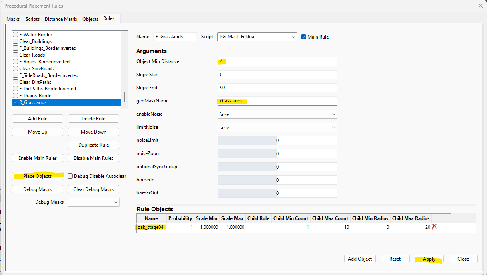

# GE Procedural Generator + Maps4FS + PG Scripts
By combining Maps4FS with the Giants Editor Procedural Generator tools we can generate textures/foliage/trees and other i3d objects in our map based on publicly available info maps of the area. 

## Installation
1. Download the PG scripts from [gitlab](https://gitlab.com/fs25_guides/fs25_proceduralgeneration/-/tree/main/PG_Scripts)
2. `Code Button` / download this directory / `zip`



3. Unzip the PG_Scripts into the `Farming Simulator 25\data\maps\proceduralPlacements` folder 
   
   The .lua files need to be directly in the `proceduralPlacements` folder.



4. Generate your map with Maps4FS as usual. 
5. Open the map in the Giants Editor
6. Remove the Trees group object
 


7. Open `Window/Procedural Placement...` and go to the `Rule` tab.
8. Before proceding, click back on your main window and save your map.
9. Press `Place Objects`



When running bigger rulesets this can take several minutes.

The editor will completly "hang" during this generation. Don't worry, just let it do it's thing.

10. You can tweak the ruleset and masks and rerun the generation. Or use this as a base to start detailing your map from.



## Changing a texture rule
1. Open `Window/Procedural Placement...` and go to the `Rule` tab.
2. Select the rule you want to edit. ex. `T_Forests`
3. Add or remove layers with the `X` buttons and the `Add Object` button.
4. Finally press `Place Objects` to see your changes.



## Changing padding on fields
1. Open `Window/Procedural Placement...` and go to the `Rule` tab.
2. Select the rule you want to edit. ex. `F_Acres`
3. Make the borderIn value bigger to shrink the field. To increase the field increase the borderOut value.
4. Often times multiple rules will need to be adjusted. ex. also update the `T_Acres` rule.
5. Finally press `Place Objects` to see your changes.



## Adding new I3D reference objects
1. Open `Window/Procedural Placement...` and go to the `Objects` tab.
2. Press `Add i3d reference`
3. Select the object you want to add.

    In the default game folder you can find the basegame tree objects: `Farming Simulator 25\data\maps\trees`
4. Give it a name. 



5. Go to the Rules tab and press `Add Rule`
6. Enter a name for the rule. ex. R_Grasslands
7. Select the PG_Mask_Fill.lua script from the dropdown


8. Fill in a distance between the objects in `Object Min Distance`
8. Fill in the name of the mask you want to scatter the object in `genMaskName`. ex. Grasslands
8. Click `Add Object` and select your previously created object
9. Press `Apply`
10. Press `Place Objects`



## Default RuleSet
Rules starting with:
* MaskName -> Loads and links a Mask with a genMaskName
* T_ => Fill a mask with a texture
* F_ => Fill a mask with foliage
* Clear_ => Clears selected objects in a mask
* R_ => I3D reference objects (trees)
* Substract_ => Removes a layer from another layer

### Rules are processed top down. 
1. Loading masks
2. Mask operations
3. Texturing
4. Foliage
5. References

## Performance
A big rule-set can become slow very fast. 

### Tip 1: Disable Main Rules
If you want to repeatedly generate things to see how it looks it is adviced to disable all the main rules and only activate the rules you want to run. 
1. `Disable Main Rules`
2. Select each rule you want to run and press `Apply` to activate it
3. Press `Place Objects`

Restarting the editor or pressing the `Enable Main Rules` button will reactivate everything.

### Tip 2: 
The default ruleset includes a ClearAll rule at the start. 

This rule is a hard-resets for all the objects and takes a longer time to run. 
It can be disabled while working, and reenabled when generating the final result. 


## Configuration Options
### Generating masks from info-maps
Generate a new mask `data/masks/PG_buildings.png` based on info-maps tagged with `building` when running the generator. 
```
  {
    "name": "concrete",
    "count": 2,
    "tags": { "building": true },
    "procedural": ["PG_buildings"]
  },
```

### Creating multiple masks
Adding multiple PG_names to the `procedural` parameter generates a mask for each PG_name.
```
  {
    "name": "grassDirtPatchy",
    "count": 2,
    "tags": { "landuse": "meadow" },
    "procedural": ["PG_meadows", "PG_grasslands"]
  },
```